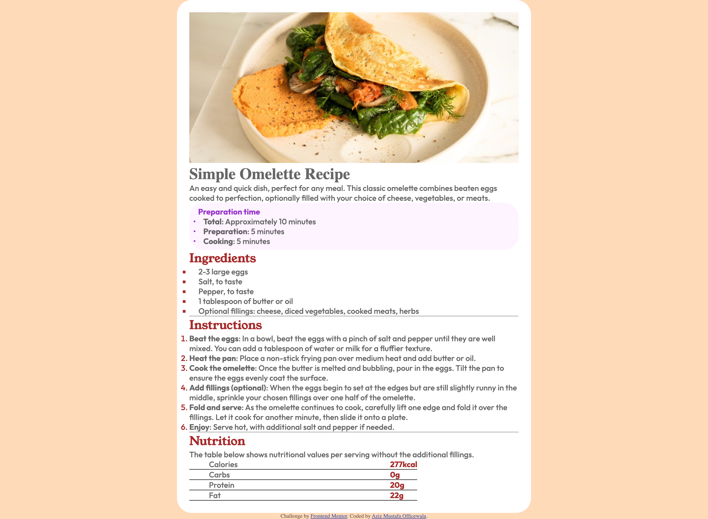

# Frontend Mentor - Recipe page solution

This is a solution to the [Recipe page challenge on Frontend Mentor](https://www.frontendmentor.io/challenges/recipe-page-KiTsR8QQKm). Frontend Mentor challenges help you improve your coding skills by building realistic projects. 

## Table of contents

- [Overview](#overview)
  - [The challenge](#the-challenge)
  - [Screenshot](#screenshot)
  - [Links](#links)
- [My process](#my-process)
  - [Built with](#built-with)
  - [What I learned](#what-i-learned)
  - [Continued development](#continued-development)
  - [Useful resources](#useful-resources)
- [Author](#author)
- [Acknowledgments](#acknowledgments)

**Note: Delete this note and update the table of contents based on what sections you keep.**

## Overview

### Screenshot




### Links

- Solution URL: [Add solution URL here](http://127.0.0.1:5500/index.html)
- Live Site URL: [Add live site URL here](http://127.0.0.1:5500/index.html)

## My process

### Built with

- Semantic HTML5 markup
- CSS custom properties
- Flexbox
- Mobile-first workflow

**Note: These are just examples. Delete this note and replace the list above with your own choices**

### What I learned

Use this section to recap over some of your major learnings while working through this project.

To see how you can add code snippets, see below:

Font Face in CSS:

```@font-face { font-family: 'outfit-black'; src: url(./assets/fonts/outfit/static/Outfit-Black.ttf); }@font-face {font-family: 'outfit-bold'; src: url(./assets/fonts/outfit/static/Outfit-Bold.ttf); }@font-face { font-family: 'young-serif'; src: url(./assets/fonts/young-serif/YoungSerif-Regular.ttf); }@font-face{ font-family: 'outfit-medium'; src: url(./assets/fonts/outfit/static/Outfit-Medium.ttf);}
```

How to color bullets:
``` 
.ing-list-elem:before {
    content: '\25A0';
    position: relative;
    right: 25px;
    color: brown;
    padding-left: 10px;
}
```
How to color numbers: 
```
#inst-list li::marker {
    color: brown;
}
```

### Continued development

There are certain parts of this site that can have continued improvement.

### Useful resources

- [StackOverflow](https://stackoverflow.com/) - This resource helped me in filling some parts of my css code.

## Author

- Website - [Aziz Mustafa Officewala](https://www.your-site.com)
- Frontend Mentor - [@random_coder](https://www.frontendmentor.io/profile/CodingAziz)
- Twitter - [@Azizreck](https://x.com/Azizreck)

## Acknowledgments

I am thankful to the internet and stackOverflow for supporting me in this project.
